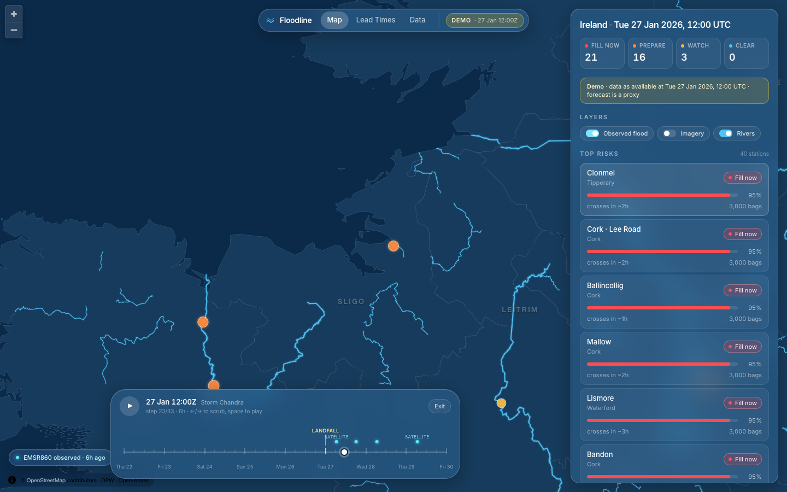

# Floodline — frontend

Ireland-wide flood lead-time tool for county councils. Full-screen MapLibre map of
Ireland with OPW gauge risk, satellite-observed flooding, decision-layer lead
times, a replay of Storm Chandra (22–30 Jan 2026), and an **Ask** tab where
Qwen, an open-weights LLM running locally, answers questions about the data and
the methods (see BACKEND.md, *Ask Floodline*).



> `docs/screenshot.png` is a placeholder captured against the mock API — replace
> it with a capture against the real backend.

## Stack

React 18 · Vite · TypeScript · Tailwind v4 · MapLibre GL JS (no API key) ·
TanStack Query · Zustand · Recharts · Turf.

## Run

```bash
pnpm install
cp .env.example .env          # API_PROXY_TARGET (default http://localhost:8000)
pnpm dev                      # http://localhost:5173
```

Two pages share the build, split in `src/main.tsx`: the landing page at `/`
(`src/landing/`) and the map app at `/map`. Each is its own chunk, so the
landing page never downloads MapLibre. Hosts must rewrite unknown paths to
`index.html` (`render.yaml` already does).

The dev and preview servers proxy `/api/*` to `API_PROXY_TARGET`, so the browser
only talks to its own origin and the backend needs no CORS setup. If the
backend is not running you get a toast ("Backend not reachable…") rather than
a browser CORS error. To call a backend directly instead, set `VITE_API_URL`
(that backend must then allow the frontend's origin).

No backend handy? A synthetic mock of every endpoint ships with the repo:

```bash
pnpm mock                     # mock Floodline API on :8000
pnpm dev
```

Other scripts:

| script           | what it does                                                        |
| ---------------- | ------------------------------------------------------------------- |
| `pnpm build`     | type-check + production build to `dist/`                            |
| `pnpm preview`   | serve `dist/`                                                       |
| `pnpm lint`      | oxlint                                                              |
| `pnpm geo:fetch` | re-pull counties + rivers from Overpass, simplify, write `src/geo/` |

`pnpm geo:fetch -- --only=rivers` (or `--only=counties`) refreshes one file.
Overpass is often busy; the script retries across three public mirrors. Output is
committed, so the app never calls Overpass at runtime.

## Backend contract

All requests go to `VITE_API_URL` if set, otherwise to the same-origin `/api` prefix (proxied by Vite). Expected shapes live in `src/api/types.ts`
and `src/api/client.ts` normalises small variations (bare arrays vs. wrapped
objects, alternative field names). Endpoints used:

| endpoint                              | used by                                        |
| ------------------------------------- | ---------------------------------------------- |
| `GET /risk`                           | map points, sidebar counts, top risks          |
| `GET /station/{id}`                   | station detail (`?at=` appended in demo mode)  |
| `GET /lead-times`                     | Lead Times tab                                 |
| `GET /satellite/latest?bbox=`         | observed-flood layer (viewport), proximity     |
| `GET /satellite/wms`                  | Sentinel-2 raster source (Imagery toggle)      |
| `GET /data-status`                    | Data tab                                       |
| `POST /settings`                      | decision-layer defaults form                   |
| `GET /demo/timeline`                  | demo scrubber                                  |
| `GET /demo/risk|lead-times|satellite?at=` | everything above while in demo mode        |

The frontend never blocks on satellite endpoints: a failed `/satellite/*` call
resolves to `status: "unavailable"` and the badge turns grey.

## Map layer stack

Bottom → top. Every layer is inserted at its slot by `src/map/order.ts`
regardless of mount order; one file per layer under `src/map/`.

```
 ┌──────────────────────────────────────────────────────────────┐
 │ risk-selected   white ring on the selected station            │  riskLayer.ts
 │ risk-points     circle / station, colour = status,            │
 │                 radius = risk score × zoom                    │
 │ risk-halo       pulsing glow (PREPARE, FILL_NOW)              │
 ├──────────────────────────────────────────────────────────────┤
 │ demo-sat-line / -hatch / -fill   EMSR860 polygons, fade in    │  demoSatelliteLayer.ts
 │                 when scrubber crosses acquisition_utc         │
 ├──────────────────────────────────────────────────────────────┤
 │ observed-line / -hatch / -fill   Sentinel-1 observed flood,   │  observedFloodLayer.ts
 │                 #7FE3FF 35 % + diagonal hatch, zoom ≥ 8       │
 ├──────────────────────────────────────────────────────────────┤
 │ rivers / rivers-glow   #4FC3F7, width by zoom, outer glow     │  riversLayer.ts
 ├──────────────────────────────────────────────────────────────┤
 │ county-line     faint borders                                 │  baseLayers.ts
 │ land            #163B5C island fill (30 % while imagery on)   │
 ├──────────────────────────────────────────────────────────────┤
 │ s2-wms          Sentinel-2 WMS raster, Imagery on + zoom ≥ 11 │  sentinel2Layer.ts
 ├──────────────────────────────────────────────────────────────┤
 │ sea             #0B2A4A background                            │  MapView.tsx
 └──────────────────────────────────────────────────────────────┘
   county names: HTML markers at each county's centre of mass     countyLabels.ts
```

## Project layout

```
scripts/fetch-geo.ts      Overpass → turf simplify → src/geo/*.json
scripts/mock-api.mjs      synthetic backend for local dev
src/api/types.ts          backend shapes
src/api/client.ts         fetch + normalisers
src/api/queries.ts        TanStack Query hooks, demo preloading
src/store.ts              single Zustand store: mode, tab, selection, layer
                          toggles, demo timeline/index/playing, toasts, bbox
src/map/                  MapView + one file per layer
src/components/           Navbar, Sidebar (MapPanel, StationDetail),
                          LeadTimesTab, DataTab, AskTab, DemoPill, SatelliteBadge, Toasts
src/geo/ireland.json      32 county polygons + dissolved island (OSM, ODbL)
src/geo/rivers.json       78 rivers as MultiLineStrings (OSM waterway=river)
src/landing/              marketing landing page: flooding hero, depth gauge,
                          sections, Storm Chandra replay; links in links.ts
```

## Behaviour notes

- **Live mode** refetches `/risk` and `/lead-times` every 2 min, the observed
  flood layer on map `moveend` (debounced 800 ms) and every 10 min.
- **Demo mode** fetches `/demo/timeline`, then preloads risk, lead-times and
  satellite for every step (4 in flight at a time) so scrubbing is instant.
  Play advances one step per 1.5 s. `←`/`→` scrub, space toggles play.
- **Satellite proximity** ("Observed flooding 2.1 km away", the Observed column)
  is computed client-side with turf against the Ireland-wide
  `/satellite/latest` response (or the demo polygons), threshold 3 km.
- **Mobile** (< 768 px): sidebar becomes a bottom sheet, demo pill collapses to
  play/pause + time.
- Dark UI only. Inter via Google Fonts with system fallback.

## Attribution

Map data © OpenStreetMap contributors (ODbL). Hydrometric data © OPW. Forecasts
via Open-Meteo. Contains modified Copernicus Sentinel data.
